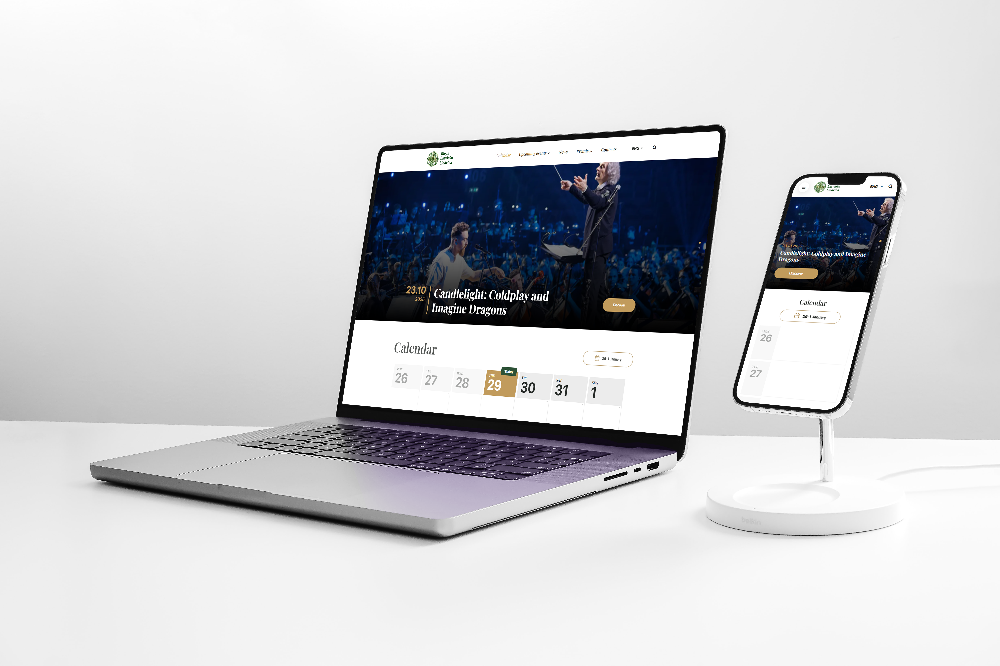

# RLB Website (Rīgas Latviešu biedrība)

> 🌍 Многостраничный HTML/CSS/JS сайт для культурной и событийной организации

**RLB** - это многостраничный статический сайт, реализованный на чистом HTML, CSS и JavaScript. Проект представляет собой полноценный веб-сайт культурной организации с афишей мероприятий, страницами событий, командами, арендой помещений и информационными разделами.

---

## 🔗 Ссылки

📌 **Live preview (main page):**  
👉 https://wlad96.github.io/rlb

📌 **Preview всех страниц:**  
👉 https://wlad96.github.io/rlb/

📦 **GitHub репозиторий:**  
👉 https://github.com/wlad96/rlb

🎨 **Figma дизайн:**  
👉 https://www.figma.com/design/7r5OKvfKIPFShcJZlozNb3/R%C4%ABgas-Latvie%C5%A1u-biedr%C4%ABba--1-?node-id=0-1&t=a0eNXhiD5FLgOMyw-1

---

## 🖼 Preview

---

## 🛠 Используемые технологии

- **HTML5** - семантическая многостраничная разметка  
- **CSS3** - адаптивная вёрстка, Flexbox, Grid, media queries  
- **JavaScript (Vanilla JS)** - интерактивные элементы  
- **Responsive Design** - поддержка desktop / tablet / mobile  
- **GitHub Pages** - деплой и live preview  

---

## 📄 Страницы сайта

Проект включает в себя следующие страницы:

- Main Page  
- Events v1  
- Events v2  
- Event detail v3  
- Events page (Buy ticket)  
- Events page (Box office)  
- Premises for rent  
- Zelta zāle page  
- Teams  
- Team page: *Rīgas Latviešu biedrības koris “Latvis”*  
- About us  
- Contacts  

👉 Все страницы доступны в режиме превью по адресу:  
https://wlad96.github.io/rlb/

---

## ✨ Особенности проекта

- Многостраничная архитектура
- Страницы мероприятий с разными вариантами отображения
- Детальные страницы событий
- Разделы команд и отдельных коллективов
- Информационные и контентные страницы
- Адаптивная и кроссбраузерная вёрстка
- Использование относительных путей (полная совместимость с GitHub Pages)
